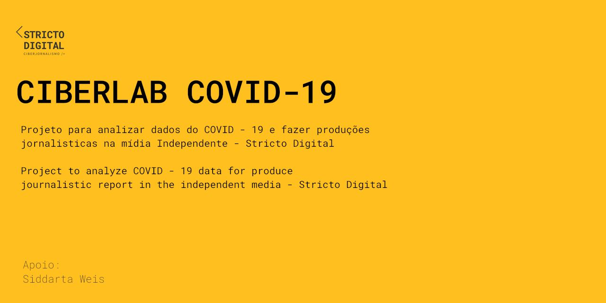

## DESCRIÇÃO / DESCRIPTION

Este projeto visa fazer um trabalho de jornalismo de dados sobre o COVID-19 relacionando dados gerais da pandemia com os dados gerados no Brasil, mais especificamente no estado da Bahia e em sua localidade Chapada Diamantina. 

Apesar do acompanhamento e estudo permanente dos dados da pandemia, no Brasil o acesso a informação ainda é negligenciado para a maior parte da população. Esta é uma iniciativa jornalistica que acompanha diversos trabalho na ciência de dados, assim como o Brasil Io, na direção de traduzir a informação para a população geral.

---

This project aims to carry out data journalism work on COVID-19, relating general data from the pandemic with data generated in Brazil, more specifically in the state of Bahia and in its locality Chapada Diamantina.

Despite the ongoing monitoring and study of pandemic data, access to information in Brazil is still neglected for most of the population. This is a journalistic initiative that accompanies several work in data science, as well as Brasil Io, in the direction of translating information for a general population.

## METODOLOGIA / METHODOLOGY

Em construção / work on it

## REFERENCIA DE DADOS / DATA REFERENCE

* ### Brasil Io

>Web site: <https://brasil.io/home/>

>Documentação / Documentation: <https://github.com/turicas/covid19-br/blob/master/api.md>

* ### Open Data SUS

>Web site: <https://opendatasus.saude.gov.br/>

